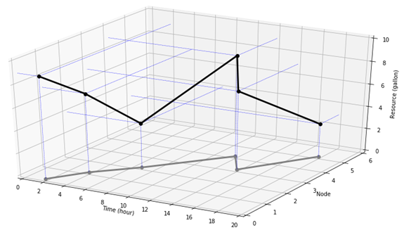

# resource-space-time-routing
An open-source tool for the optimization and visualization of the "resource-space-time" trajectories of the agents based on dynamic programming.

###Collabrators: 

Dr. Gongyuan Lu, Associate Professor, at School of Transportation and Logistics, Southwest Jiaotong University

#Goals of resource-space-time-routing development
1. Read and parse the network and agent data from the data files.
2. Provide a free and easy-to-use tool for optimizing and visualizing the resource-space-time trajectories of the agents.

#How to use

Latest Software Release 06-02-2020

Step 1: Install the Python 3.7 or a higher version of Python environment for running the code written in Python.

Step 2: Prepare the input data files "node.csv", "road_link.csv" and "agent.csv" according to the specified data format in the sample files, where the sample files are available at the "examples" folder.

Step 3: Run the python code on your computer and save the generated figure containing the space-time and resource-space-time trajectories of the agents.

The following figure shows the structure of the network in the sample files.

The following figure illustrates the structure of the network the sample files in the NeXTA software (https://github.com/xzhou99/NeXTA-GMNS).

The following two figures show the space-time and resource-space-time trajectories of the agent, respectively. The readers can check the detailed information on the input data in the "examples" folder.

Space-time trajectory of the agent:

Resource-space-time trajectory of the agent:

